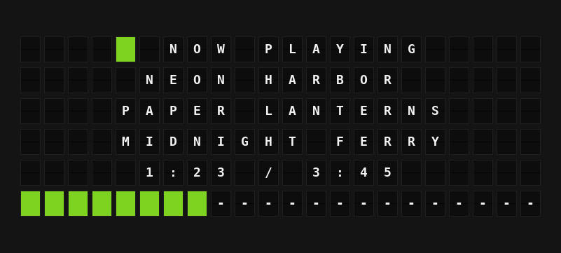

# Spotify Plugin

Show what's playing on your Spotify account: the track, artist, progress, device, and what's up next.



**→ [Setup Guide](./docs/SETUP.md)**

## Overview

The Spotify plugin reads your Spotify playback through the Spotify Web API and turns it into board-ready variables: the track or podcast episode, a time line like `1:23 / 3:45`, a progress bar as wide as your board, the playlist or album it's playing from, the device, and the next tracks in your queue. When nothing is playing it can show the last track you played.

You sign in once with FiestaBoard's **Connect** button, using a Spotify app that you create for yourself. FiestaBoard keeps the sign-in fresh; there is no password or client secret to enter. Requires a FiestaBoard version with account connection (see [Connecting Accounts](https://fiestaboard.app/docs/features/connecting-accounts)).

## Template Variables

### Now Playing

| Variable | Description | Example |
|----------|-------------|---------|
| `{{spotify.headline}}` | `NOW PLAYING`, `PAUSED`, `LAST PLAYED`, `AD BREAK` or `NOTHING PLAYING` | `NOW PLAYING` |
| `{{spotify.title}}` | Track or episode title (the last played track when nothing is playing) | `NEON HARBOR` |
| `{{spotify.artist}}` | Artists, comma-separated; the show for a podcast episode | `PAPER LANTERNS` |
| `{{spotify.album}}` | Album; the publisher for a podcast episode | `MIDNIGHT FERRY` |
| `{{spotify.title_artist}}` | Title and artist on one line | `LOW TIDE - JUNE ARCADE` |
| `{{spotify.item_type}}` | `TRACK`, `EPISODE` or `AD` | `TRACK` |
| `{{spotify.last_played_ago}}` | When the last played track finished (only when nothing is playing) | `12M AGO` |

### Playback

| Variable | Description | Example |
|----------|-------------|---------|
| `{{spotify.is_playing}}` | Playing right now (not paused) | `true` |
| `{{spotify.state}}` | `PLAYING`, `PAUSED` or `STOPPED` | `PLAYING` |
| `{{spotify.state_tile}}` | One colour tile: green playing, yellow paused, red stopped | `{66}` |
| `{{spotify.progress}}` | Position in the track | `1:23` |
| `{{spotify.duration}}` | Length of the track | `3:45` |
| `{{spotify.time_line}}` | Position and length together | `1:23 / 3:45` |
| `{{spotify.remaining}}` | Time left | `-2:22` |
| `{{spotify.progress_percent}}` | How far through, 0-100 | `37` |
| `{{spotify.progress_bar}}` | Bar as wide as the board: green tiles played, dashes to go | `{66}{66}{66}---` |
| `{{spotify.progress_ms}}` | Position in milliseconds | `83000` |
| `{{spotify.duration_ms}}` | Length in milliseconds | `225000` |

Times are as of the last refresh (every 15 seconds by default); the board does not tick between refreshes. Hour-long episodes show `1:02:03`.

### Device

| Variable | Description | Example |
|----------|-------------|---------|
| `{{spotify.device_name}}` | The Spotify Connect device playing | `KITCHEN SPEAKER` |
| `{{spotify.device_type}}` | `COMPUTER`, `SMARTPHONE`, `SPEAKER`, ... | `SPEAKER` |
| `{{spotify.volume_percent}}` | Device volume (empty if the device has none) | `65` |
| `{{spotify.shuffle}}` | Shuffle on | `false` |
| `{{spotify.repeat}}` | `OFF`, `ALL` or `ONE` | `ALL` |
| `{{spotify.modes}}` | Shuffle and repeat together; empty when both are off | `SHUFFLE REPEAT ALL` |

### Playing From

| Variable | Description | Example |
|----------|-------------|---------|
| `{{spotify.context_type}}` | `PLAYLIST`, `ALBUM`, `ARTIST`, `PODCAST` or `LIKED SONGS` | `PLAYLIST` |
| `{{spotify.context_name}}` | Name of that playlist, album, artist or podcast | `SUNDAY COFFEE` |

Spotify does not share the names of its own editorial and personalized playlists (such as Discover Weekly) with apps, so `context_name` is empty for those.

### Up Next

| Variable | Description | Example |
|----------|-------------|---------|
| `{{spotify.next_title}}` | Next track in your queue | `LOW TIDE` |
| `{{spotify.next_artist}}` | Its artist | `JUNE ARCADE` |
| `{{spotify.next_line}}` | Next track and artist on one line | `LOW TIDE - JUNE ARCADE` |
| `{{spotify.queue_count}}` | Upcoming tracks known, up to 5 | `5` |
| `{{spotify.queue.0.title}}` | Title of queue entry 0-4 | `LOW TIDE` |
| `{{spotify.queue.0.artist}}` | Artist of queue entry 0-4 | `JUNE ARCADE` |
| `{{spotify.queue.0.line}}` | Title and artist of queue entry 0-4 | `LOW TIDE - JUNE ARCADE` |

All text is in capitals, accents are folded (`BEYONCE`), and characters the board can't show are dropped.

## Example Templates

Flagship (center-aligned, the demo page):

```jinja
{{spotify.state_tile}} {{spotify.headline}}
{{spotify.title}}
{{spotify.artist}}
{{spotify.album}}
{{spotify.time_line}}
{{spotify.progress_bar}}
```

Note (left-aligned):

```jinja
{{spotify.title}}
{{spotify.artist}}
{{spotify.state_tile}} {{spotify.time_line}}
```

Now playing and up next (Flagship, center-aligned):

```jinja
{{spotify.state_tile}} {{spotify.title}}
{{spotify.artist}}
{{spotify.time_line}}

UP NEXT
{{spotify.next_line}}
```

## Configuration

| Setting | Type | Required | Default | Description |
|---------|------|----------|---------|-------------|
| `enabled` | boolean | No | `false` | Turn the plugin on |
| `client_id` | string | Yes | | Client ID of your own app in the Spotify Developer Dashboard |
| `show_last_played` | boolean | No | `true` | When nothing is playing, show the last track played |
| `show_queue` | boolean | No | `true` | Fetch your queue for the Up Next variables |
| `tidy_titles` | boolean | No | `true` | Drop `- Remastered 2011` and `(feat. ...)` from track titles |
| `refresh_seconds` | integer | No | `15` | How often to ask Spotify what's playing (10-300) |

The sign-in itself is not a setting: press **Connect** in the plugin's **Account connection** section. The manifest's `oauth` block declares Spotify's authorization and token endpoints with the relay flow (authorization code with PKCE, no client secret) and these read-only scopes:

| Scope | Used for |
|-------|----------|
| `user-read-playback-state` | `GET /me/player` (track, progress, device, shuffle, repeat, context) and the queue |
| `user-read-currently-playing` | `GET /me/player/queue` (Spotify requires both scopes for it) |
| `user-read-recently-played` | `GET /me/player/recently-played` (the last played track) |

No environment variables: the client ID lives in the plugin settings because the platform reads it from there.

## Features

- Signs in with FiestaBoard's account connection, so it works on a board that lives on your home network. PKCE only, no client secret; FiestaBoard stores and refreshes the tokens and the plugin asks for the current one on every refresh
- Tracks and podcast episodes, paused state, ad breaks, and nothing playing (Spotify's `204 No Content`)
- Last played track when nothing is playing, with how long ago
- Progress as `1:23 / 3:45`, a percentage, and a bar sized to the board it's shown on (22 tiles on a Flagship, 15 on a Note)
- Playlist, album, artist, podcast or Liked Songs it's playing from; playlist names are looked up once and remembered
- Up to five upcoming tracks from your queue, fetched again only when the track changes or after a minute
- Removes remaster and featuring notes from titles so more of the title fits
- One request to Spotify serves every board: a Flagship and a Note showing the same plugin share it
- Respects Spotify's `Retry-After` on rate limits and backs off after outages, timeouts and rejected sign-ins instead of retrying on every render. During a short outage the board keeps the last data (up to two minutes old)
- Error messages say what to do: connect, reconnect after a `401`, add yourself under **User Management** after a `403`
- Works on every board shape: Flagship, Note, and Note arrays

## Author

FiestaBoard Team
